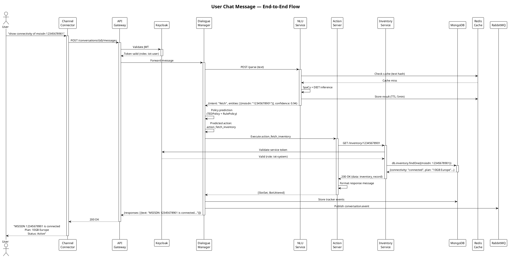
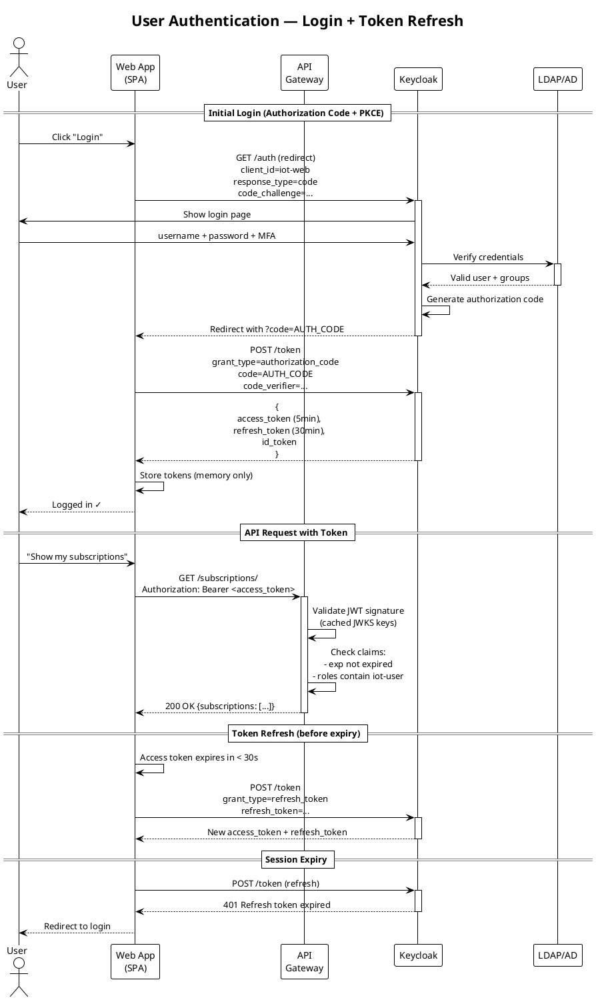
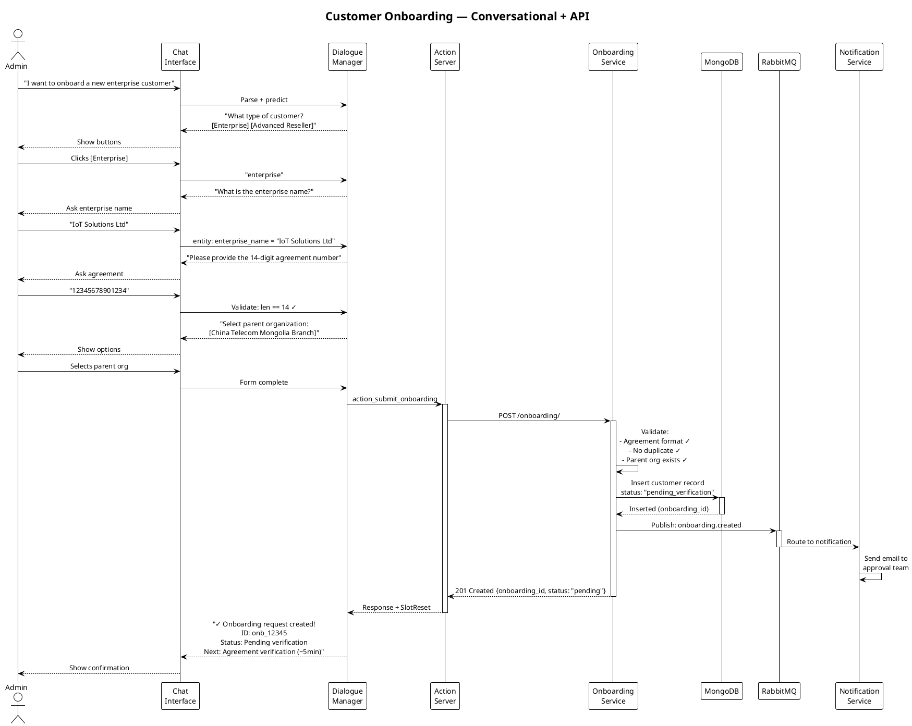
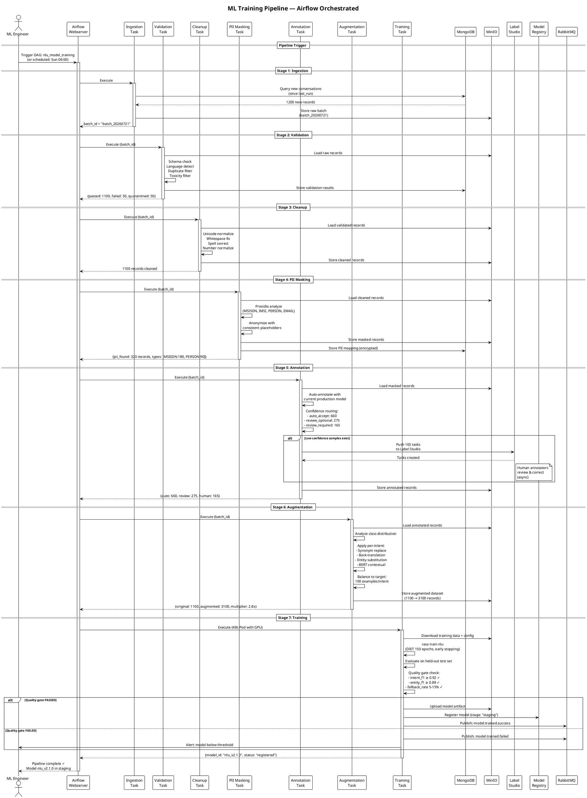
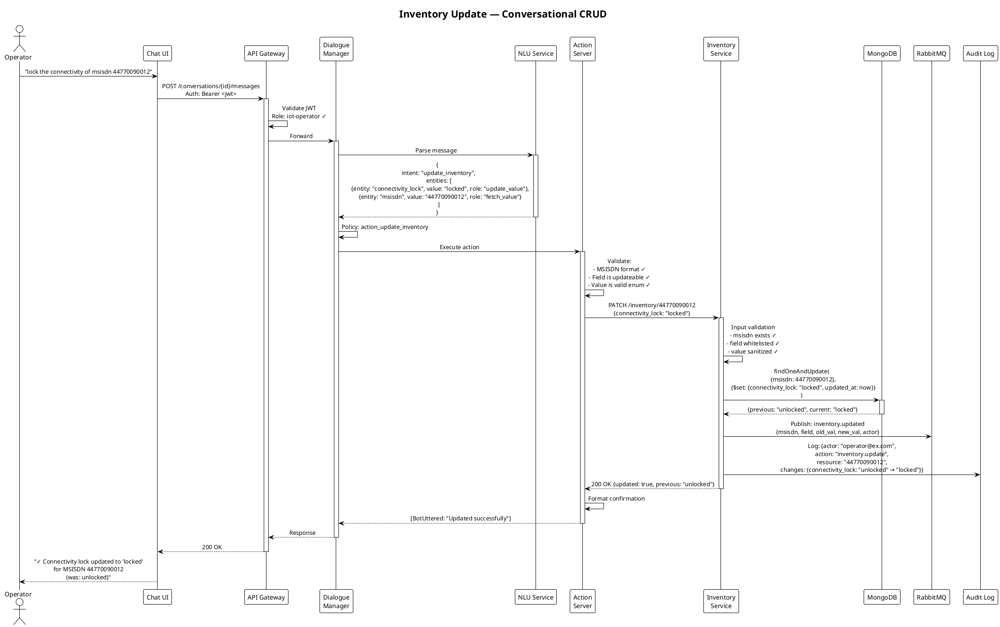
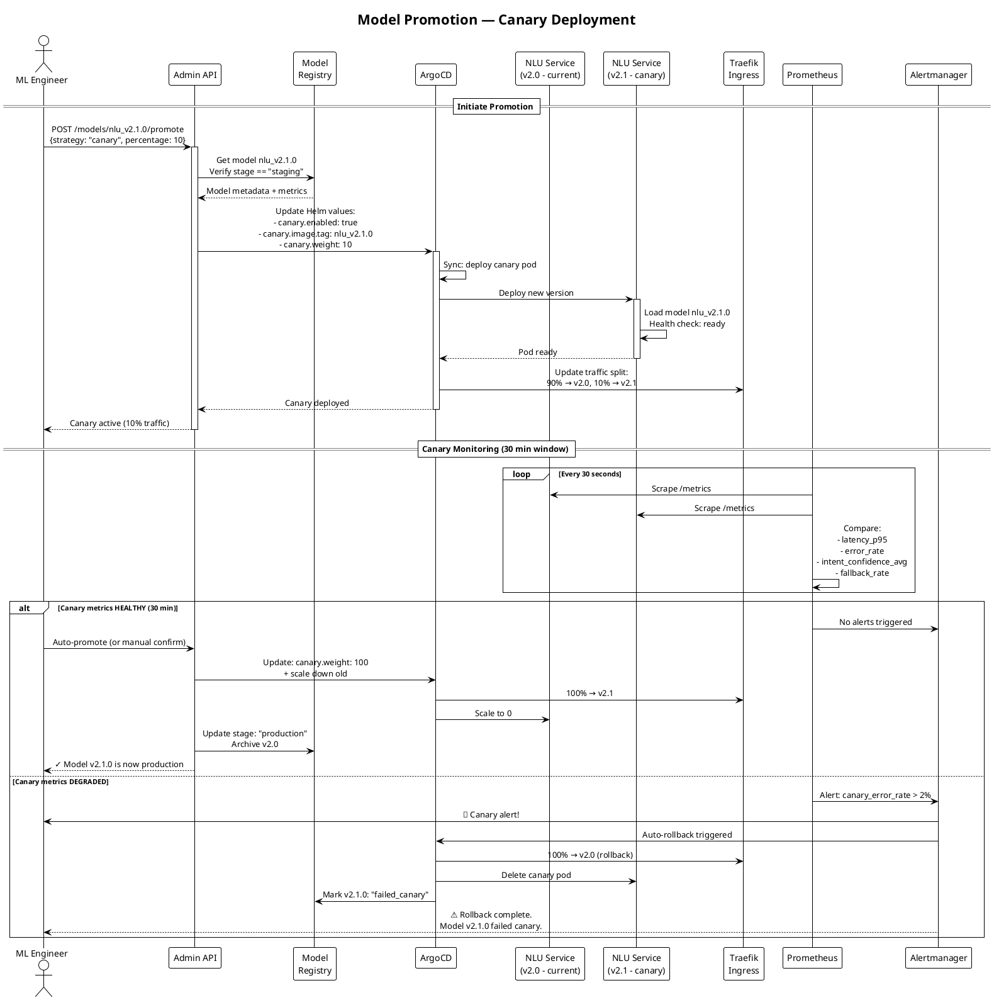
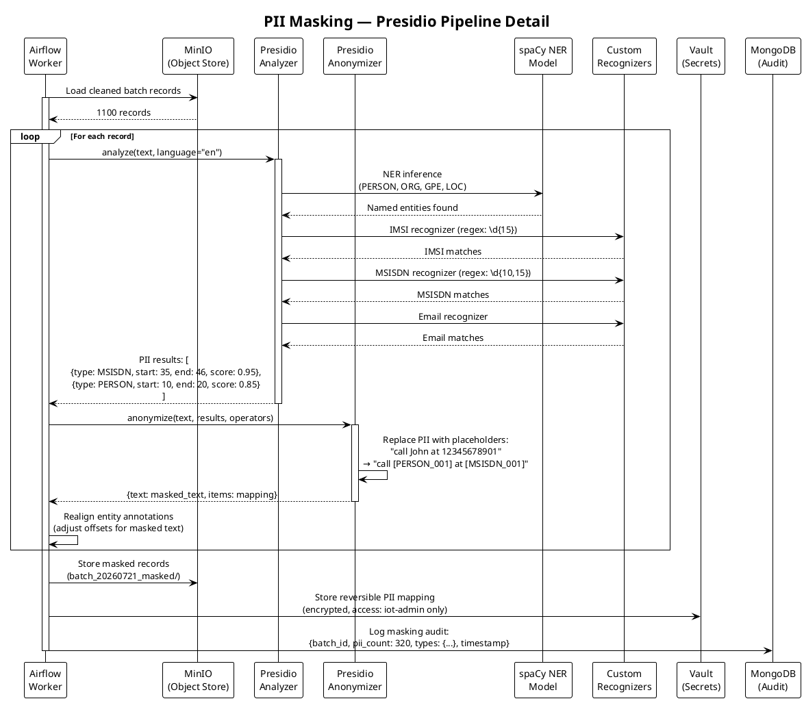
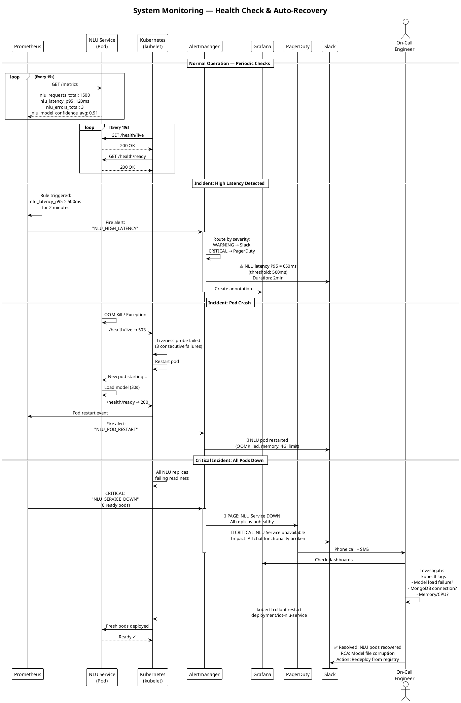
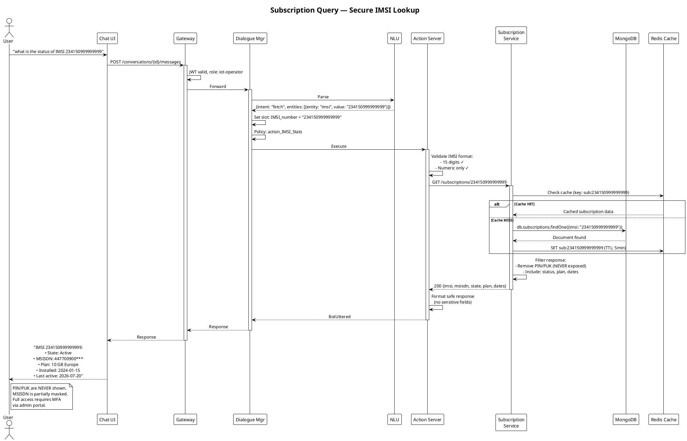
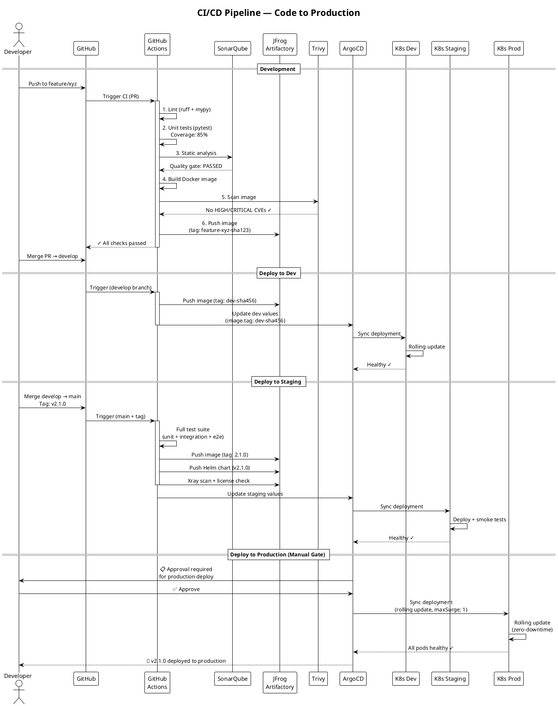

# System Sequence Diagrams — IoT Digital Assistant

> **Version:** 2.0  
> **Date:** 2026-07-21  
> **Format:** PlantUML  
> **Flows Covered:** 8 major system interactions

---

## 1. User Chat Message Flow (Core Conversation)

The primary flow: user sends a message → NLU → Dialogue → Action → Business Service → Response.



---

## 2. User Authentication Flow



---

## 3. Customer Onboarding Flow



---

## 4. ML Training Pipeline Flow



---

## 5. Inventory Update Flow (via Chat)



---

## 6. Model Deployment (Canary) Flow



---

## 7. Data Pipeline — PII Masking Detail



---

## 8. System Health Monitoring & Incident Response



---

## 9. Subscription Query Flow (IMSI Lookup)



---

## 10. CI/CD Deployment Flow



---

## Diagram Index

| # | Diagram | Key Flow | Participants |
|---|---------|----------|--------------|
| 1 | Chat Message Flow | User → NLU → Dialogue → Action → DB → Response | 10 components |
| 2 | Authentication Flow | Login → JWT → API calls → Refresh | 5 components |
| 3 | Customer Onboarding | Conversational form → Validation → DB → Notification | 8 components |
| 4 | ML Training Pipeline | Ingest → Validate → Clean → Mask → Annotate → Train | 13 components |
| 5 | Inventory Update | Chat → NLU → Action → Validate → Update → Audit | 10 components |
| 6 | Model Deployment | Staging → Canary → Monitor → Promote/Rollback | 8 components |
| 7 | PII Masking Detail | Presidio → spaCy → Custom recognizers → Vault | 8 components |
| 8 | System Monitoring | Prometheus → Alerts → PagerDuty → Recovery | 8 components |
| 9 | Subscription Query | Secure IMSI lookup with caching + masking | 8 components |
| 10 | CI/CD Pipeline | Code → Lint → Test → Scan → Build → Deploy (dev→stg→prod) | 9 components |

---

## How to Render

```bash
# Install PlantUML
brew install plantuml

# Render all diagrams to PNG
plantuml docs/architecture/05_SEQUENCE_DIAGRAMS.md -o ./docs/architecture/diagrams/

# Or use the online server
# https://www.plantuml.com/plantuml/uml/
```

---

*This completes the system architecture documentation suite. All files:*
- *[01_SYSTEM_ARCHITECTURE.md](./01_SYSTEM_ARCHITECTURE.md) — System overview*
- *[02_DATA_PIPELINE.md](./02_DATA_PIPELINE.md) — Airflow ETL pipeline*
- *[03_API_DESIGN.md](./03_API_DESIGN.md) — API specifications*
- *[04_INFRASTRUCTURE.md](./04_INFRASTRUCTURE.md) — Deployment architecture*
- *[05_SEQUENCE_DIAGRAMS.md](./05_SEQUENCE_DIAGRAMS.md) — This file*
